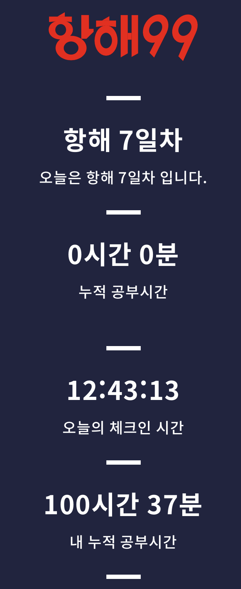

# 내가 개발자가 되고싶은 이유 + 첫번째 주간 회고 (3월 7일 ~ 3월 13일)

## 개발자를 도전하기까지

 

이번주는 작년을 포함해서 가장 바쁘고 설레는 일주일이었지만 왜 개발자가 되기로 했는지 간단하게 기록하고싶은 마음에 한시간정도 생각을 정리하고 회고에 같이 적기로 했다.  
2021년 1월21일, 개발자가 되겠다는 목표로 공부를 시작했다. 주변에서는 "3개월 ~ 6개월만에 개발자가 될수있다", "빨리 현업에가서 경험을쌓는게 중요하다" , "비전공자 서른이면 늦은나이다" 같은 말을 많이 들었다. 맞는 말이지만 개발자라는 직업에 확신을 가지고 싶었기에 최소1년은 공부하겠다고 다짐했다.  
 

확신을 1년이나? 할 수도 있지만 과거의 실패를 반복하기 않으려는 결심이었다.  
대학생때 편입공부를 했었다. 10개월을 아침부터 새벽까지 공부"만" 했고 당연히(?) <u>실패</u>했다. 처음 몇달동안 머리가 하얘졌다. 하지만 지금 생각해보면 이 경험이 나의 터닝포인트였다.  
 **"도전하려는것에 정확하고 구체적인 목표를 세우는것이 얼마나 중요한지"**  온몸으로 배웠기 떄문이다.  

 

이 경험을 바탕으로 승무원이 되기위한 1년 커리큘럼을 만들었다. 정확히 졸업 1년 후 한번에 원하던 항공사에 합격했다. 생명공학을 전공했지만 구체적인 목표로 비전공자라는 허들은 쉽게 넘었다. 겉보기엔 완벽한 직업이었다. 하지만 반쪽짜리 성공 이라는걸 1년도 되지 않아 알게되었다.  

  

일하는 시간은 쌓여갔지만 내 지식수준은 멈춰있었다. 편입을 도전했던 이유도 새로운걸 배우며 성장하고 싶었기 때문인데 오히려 그때보다도 퇴보하고 있었다.  
그래서 평소 관심이 많았던 개발자에 대해 찾아보고 유튜브, 하버드 CS50, 생활코딩을 시간 가는 줄 모르고 공부했다. 퇴사 후 국비교육, 부트캠프처럼 배울 기회가 많았고 학원에서 기본적인 프론트앤드와 백엔드를 배웠다.

 

바로 백엔드 개발자를 준비했으면 좋앟겠지만, 6개월동안 인공지능 부트캠프 과정을 수료 했다. "어렵고 생소한것을 어떻게든 해내는 근성을 배운 6개월" 이었다. 인공지능 개발도 재밌었지만 데이터관리, 알고리즘, 설계에 더 큰 흥미를 느꼈다. 

 

백엔드 개발자가 되겠다는 결심을 하기까지 1년이라는 긴 시간이 걸렸지만 후회하지 않는다. 어떤 직업을 가지는데 1년도 걸리지않는다면 그만큼 경쟁력 없고 성취감없는 직업이지 않을까?.  
무엇보다 정말로 적성에 맞는일을 찾았다는게 너무 행복하다.

 

--- 

## 주간 회고 (WIL)
 

주간 회고 까지 서론이 길었지만, 지금은 <u>항해99 부트캠프 Java-Spring 주특기 과정</u>에 참여해서 공부하고있다.  

첫주에는 팀장을 맡아 팀원 세명과 미니프로젝트를 했다. 이론을 이해하는것과 실전프로젝트를 협업으로 진행하는건 천지차이였고 많은걸 배울 수 있었다.  
다행히도 실력이 좋은 팀원들을 만나서 프로젝트를 끝낼 수 있었고 팀원들이 하루 12시간넘게 공부하는 모습을보고 큰 동기부여가 됬다.  
사실 프로젝트에 사용한 스택이나 기술, 문제점극복 같은 내용을 적으려했지만 첫주는 내 마음가짐도 기록할겸 주간회고는 간단히 적기로 했다.   

  

(팀원들의 캠화면이 없었다면 아마 100시간은 못했을것 같다.)

